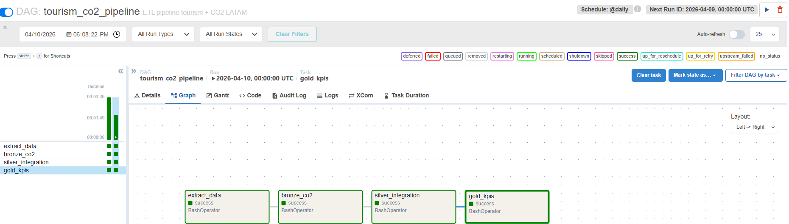
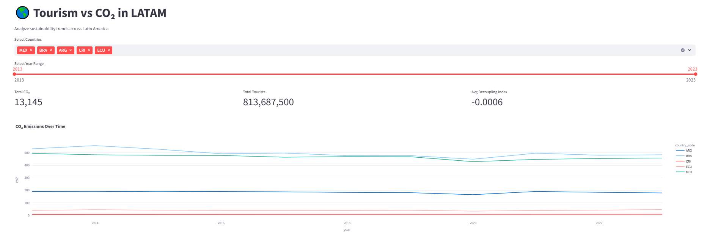
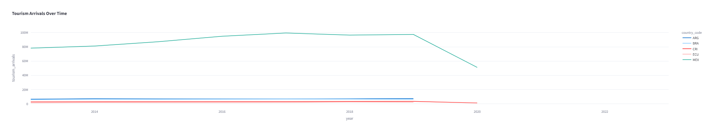
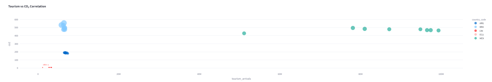
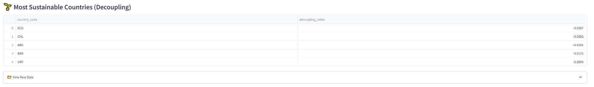

# 🌎 Tourism vs CO₂ in LATAM  
### End-to-End Data Pipeline with Airflow + Streamlit

🚀 Live Demo: 🚀 Live Demo: https://tourism-co2-latam-data-pipeline-wrpgpj54yuhwc66tdgqmqn.streamlit.app/  

---

## 📌 Overview

This project is an end-to-end data pipeline that analyzes the relationship between **tourism activity and CO₂ emissions across Latin America**.

It integrates multiple datasets, processes them through a layered architecture (Bronze → Silver → Gold), orchestrates workflows using Apache Airflow, and presents insights through an interactive Streamlit dashboard.


## ⚠️ Disclaimer

This repository represents a **personal implementation** of a data engineering project.

While a separate version of this project is being developed collaboratively as part of a team assignment, this repository:

- Uses a **different architecture and implementation approach**
- Was built **independently for learning and portfolio purposes**
- Does **not replicate or reuse team-owned code or assets**

The goal of this project is to demonstrate individual skills in:

- Data pipeline design  
- Workflow orchestration  
- Data modeling (Bronze / Silver / Gold)  
- Data visualization and deployment  


---

## 🧠 Architecture



### 🔄 Data Flow

1. **Extract**
   - Tourism data
   - CO₂ emissions (OWID)

2. **Bronze Layer**
   - Raw partitioned data by country and year

3. **Silver Layer**
   - Cleaned and integrated datasets

4. **Gold Layer**
   - Aggregated KPIs ready for analytics

5. **Visualization**
   - Interactive dashboard (Streamlit)

---

## ⚙️ Tech Stack

- 🐍 Python  
- 📊 Pandas  
- 🔄 Apache Airflow  
- 🐳 Docker  
- 🌐 Streamlit  
- 📁 Parquet (data storage)

---

## 📊 Dashboard Features

### 🌱 KPIs Overview
- Total CO₂ emissions  
- Total tourism arrivals  
- Decoupling index  

---

### 📈 CO₂ Emissions Over Time


---

### ✈️ Tourism Trends


---

### 🔗 Correlation Analysis


---

### 🏆 Sustainability Ranking


---

## 🗂️ Project Structure

├── dags/ # Airflow DAGs
├── scripts/ # ETL scripts
├── dashboard/ # Streamlit app
├── data/
│ ├── gold/ # Final curated dataset
├── assets/ # Images for documentation
├── docker-compose.yml # Airflow setup
├── requirements.txt


---

## 🚀 How to Run Locally

### 1. Clone repo
```bash
git clone https://github.com/LuisBuruato/tourism-co2-latam-data-pipeline.git
cd tourism-co2-latam-data-pipeline


streamlit run dashboard/app.py


📌 Key Insights
Tourism growth does not always correlate linearly with CO₂ emissions
Some countries show signs of decoupling, indicating sustainable growth
COVID-19 created visible disruptions in both tourism and emissions

💼 Why This Project Matters

This project demonstrates:

End-to-end data engineering skills
Workflow orchestration with Airflow
Data modeling (Bronze / Silver / Gold)
Data visualization & storytelling
Production-ready pipeline design
📬 Contact

👤 Luis Ramón Buruato
📧 luisburuato@gmail.com

🔗 https://github.com/LuisBuruato

🔗 https://www.linkedin.com/in/luis-ramon-buruato-1a949741/

⭐ If you like this project

Give it a star ⭐ on GitHub!
